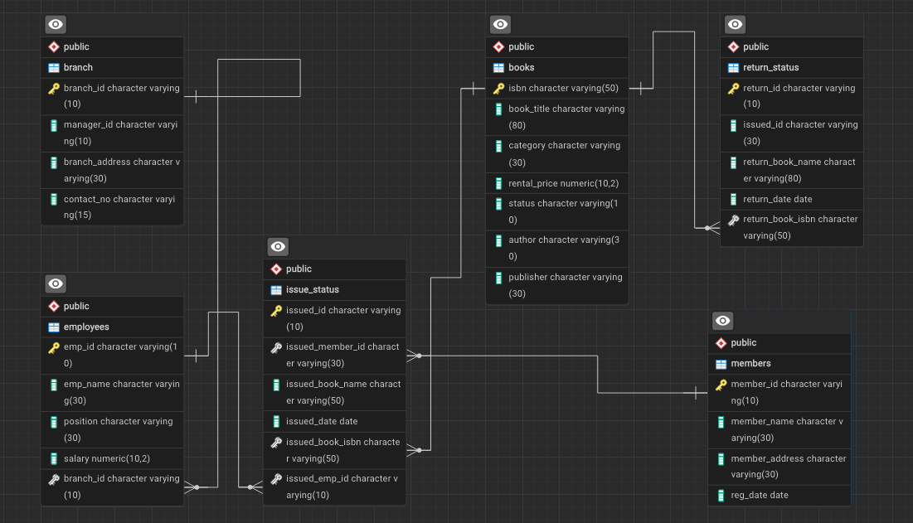

# Library Management System SQL Project

This project contains a complete SQL script for creating, managing, and querying a database for a library management system.

The project demonstrates:
* **Database Schema Design:** Creation of all tables (`branch`, `employees`, `books`, `members`, `issued_status`, `return_status`).
* **Data Integrity:** Use of `PRIMARY KEY` and `FOREIGN KEY` constraints to link tables.
* **CRUD Operations:** Examples of `INSERT`, `UPDATE`, and `DELETE` commands.
* **Complex Queries:** `JOIN`s, `GROUP BY`, aggregate functions, and subqueries to answer 12 common business questions.
* **Data Persistence:** Use of `CTAS` (`CREATE TABLE AS SELECT`) to create summary tables.

---

## Database Schema (ERD)

The database consists of 6 tables linked by foreign keys to manage books, members, employees, and transactions.


---

## Database Setup Script

This script includes all `CREATE TABLE` and `ALTER TABLE` statements needed to build the database structure.

<details>
<summary>Click to view the full Database Schema SQL</summary>

```sql
-- Creating tables
DROP TABLE IF EXISTS return_status;
DROP TABLE IF EXISTS issued_status;
DROP TABLE IF EXISTS employees;
DROP TABLE IF EXISTS members;
DROP TABLE IF EXISTS books;
DROP TABLE IF EXISTS branch;

CREATE TABLE branch(
    branch_id VARCHAR(20) PRIMARY KEY ,
    manager_id VARCHAR(25),
    branch_address VARCHAR(25),
    contact_no VARCHAR(20)
);

CREATE TABLE employees(
    emp_id VARCHAR(25) PRIMARY KEY,
    emp_name VARCHAR(25),
    position VARCHAR(25),
    salary INT,
    branch_id VARCHAR(20) 
);

CREATE TABLE books(
    isbn VARCHAR(20) PRIMARY KEY,
    book_title VARCHAR(55) ,
    category VARCHAR(20), 
    rental_price FLOAT,
    status VARCHAR(10) ,
    author VARCHAR(25) ,
    publisher VARCHAR(30)
);

CREATE TABLE members(
    member_id VARCHAR(20) PRIMARY KEY,
    member_name VARCHAR(25) ,
    member_address VARCHAR(25), 
    reg_date DATE
);

CREATE TABLE issued_status(
    issued_id VARCHAR(20) PRIMARY KEY,
    issued_member_id VARCHAR(20),--fk
    issued_book_name VARCHAR(55),
    issued_date DATE,
    issued_book_isbn VARCHAR(20),--fk
    issued_emp_id VARCHAR(25) --fk
);

CREATE TABLE return_status(
    return_id VARCHAR(20) PRIMARY KEY,
    issued_id VARCHAR(20),
    return_book_name VARCHAR(75),
    return_date DATE,
    return_book_isbn VARCHAR(20)
);

-- ADDING FOREIGN KEY CONSTRAINTS
ALTER TABLE issued_status
ADD CONSTRAINT fk_members
FOREIGN KEY (issued_member_id)
REFERENCES members(member_id);

ALTER TABLE issued_status
ADD CONSTRAINT fk_books
FOREIGN KEY (issued_book_isbn)
REFERENCES books(isbn);

ALTER TABLE issued_status
ADD CONSTRAINT fk_employees
FOREIGN KEY (issued_emp_id)
REFERENCES employees(emp_id);

ALTER TABLE employees
ADD CONSTRAINT fk_branch
FOREIGN KEY (branch_id)
REFERENCES branch(branch_id);

ALTER TABLE return_status
ADD CONSTRAINT fk_issued_status
FOREIGN KEY (issued_id)
REFERENCES issued_status(issued_id);
```
</details>

---

## SQL Queries and Operations

Here are 12 queries demonstrating how to interact with the database.

### Q1: Create a New Book Record
**Objective:** Create a new book record for 'To Kill a Mockingbird'.

```sql
INSERT INTO books(isbn, book_title, category, rental_price, status, author, publisher)
VALUES('978-1-60129-456-2', 'To Kill a Mockingbird', 'Classic', 6.00, 'yes', 'Harper Lee', 'J.B. Lippincott & Co.');

SELECT * FROM books 
WHERE isbn='978-1-60129-456-2';
```

### Q2: Update an Existing Member's Address
**Objective:** Update the address for the member with `member_id` = 'C101'.

```sql
UPDATE members
SET member_address='riyadh,saudi arabia'
WHERE member_id='C101';

SELECT * FROM members
WHERE member_address='riyadh,saudi arabia';
```

### Q3: Delete a Record from the Issued Status Table
**Objective:** Delete the record with `issued_id` = 'IS121'.

```sql
DELETE FROM issued_status
WHERE issued_id = 'IS121';

SELECT * FROM issued_status 
WHERE issued_id = 'IS121';
```

### Q4: Retrieve All Books Issued by a Specific Employee
**Objective:** Select all books issued by the employee with `emp_id` = 'E101'.

```sql
SELECT * FROM issued_status 
WHERE issued_emp_id = 'E101';
```

### Q5: List Members Who Have Issued More Than One Book
**Objective:** Use `GROUP BY` to find members who have issued more than one book.

```sql
SELECT issued_member_id, COUNT(*)
FROM issued_status
GROUP BY 1
HAVING COUNT(*) > 1;
```

### Q6: Create Summary Table of Book Issue Counts
**Objective:** Use `CTAS` to generate a new table summarizing how many times each book has been issued.

```sql
CREATE TABLE book_issued_cnt AS
SELECT issued_book_isbn, issued_book_name , COUNT(*) AS how_many_time_issued 
FROM issued_status 
GROUP BY 1 ,2
ORDER BY how_many_time_issued DESC;
```

### Q7: Retrieve All Books in a Specific Category
**Objective:** Select all books in the 'Classic' category.

```sql
SELECT *
FROM books
WHERE category='Classic';
```

### Q8: Find Total Rental Income by Category
**Objective:** Calculate the sum of rental prices for all books, grouped by category.

```sql
SELECT category, SUM(rental_price) AS total_rental_income 
FROM books 
GROUP BY 1
ORDER BY total_rental_income DESC;
```

### Q9: List Members Who Registered in the Last 180 Days
**Objective:** Find members who registered within the last 180 days *relative to the latest registration date in the table*.

```sql
SELECT * FROM members
WHERE reg_date >= ((SELECT MAX(reg_date) FROM members) - INTERVAL '180 days');
```

### Q10: List Employees with Their Manager's Name and Branch Details
**Objective:** Join the `employees` table to itself and the `branch` table to show each employee, their manager, and their branch information.

```sql
SELECT e.emp_id, e.emp_name, e2.emp_name AS manager, b.*
FROM employees AS e
LEFT JOIN branch AS b
ON e.branch_id = b.branch_id
JOIN employees AS e2
ON e2.emp_id = b.manager_id;
```

### Q11: Create a Table of Books with Rental Price Above a Certain Threshold
**Objective:** Use `CTAS` to create a new table containing only books with a rental price greater than 4.

```sql
CREATE TABLE rental_abobe_4 AS 
SELECT * FROM books
WHERE rental_price > 4;
```

### Q12: Retrieve the List of Books Not Yet Returned
**Objective:** Find all books in the `issued_status` table that do not have a matching entry in the `return_status` table.

```sql
SELECT *
FROM issued_status AS i
LEFT JOIN return_status AS r
ON r.issued_id = i.issued_id
WHERE r.return_id IS NULL;
```
Q13 – Identify Members with Overdue Books
SELECT 
    i.issued_member_id,
    m.member_name,
    i.issued_book_name,
    i.issued_date,
    CURRENT_DATE - i.issued_date AS days_overdue
FROM members AS m
INNER JOIN issued_status AS i
    ON m.member_id = i.issued_member_id
LEFT JOIN return_status AS r
    ON r.issued_id = i.issued_id
WHERE r.issued_id IS NULL 
  AND CURRENT_DATE - i.issued_date > 30
ORDER BY 5 DESC;

🔁 Q14 – Update Book Status on Return (Stored Procedure)
CREATE OR REPLACE PROCEDURE return_status_up(
    up_return_id VARCHAR(20),
    up_issued_id VARCHAR(20),
    up_book_quality VARCHAR(15)
)
LANGUAGE plpgsql
AS $$
DECLARE 
    i_isbn VARCHAR(20);
    i_book_name VARCHAR(55);
BEGIN
    INSERT INTO return_status(return_id, issued_id, return_date, book_quality)
    VALUES (up_return_id, up_issued_id, CURRENT_DATE, up_book_quality);

    SELECT issued_book_isbn, issued_book_name
    INTO i_isbn, i_book_name
    FROM issued_status
    WHERE issued_id = up_issued_id;

    UPDATE books
    SET status = 'yes'
    WHERE isbn = i_isbn;

    RAISE NOTICE 'Return is complete for book: %', i_book_name;
END;
$$;

CALL return_status_up('RS119', 'IS135', 'bad');

🏢 Q15 – Branch Performance Report
SELECT 
    e.branch_id,
    COUNT(i.issued_id) AS books_issued,
    COUNT(r.return_id) AS books_returned,
    SUM(b.rental_price) AS total_revenue
FROM employees AS e
JOIN issued_status AS i
    ON i.issued_emp_id = e.emp_id
LEFT JOIN return_status AS r
    ON i.issued_id = r.issued_id
JOIN books AS b
    ON b.isbn = i.issued_book_isbn
GROUP BY 1;

👥 Q16 – Create Table of Active Members (CTAS)
CREATE TABLE active_members AS
SELECT 
    m.member_id,
    m.member_name,
    COUNT(i.issued_member_id) AS issued_books
FROM members AS m
INNER JOIN issued_status AS i
    ON m.member_id = i.issued_member_id
WHERE issued_date >= (CURRENT_DATE - INTERVAL '60 days') 
GROUP BY 1, 2
HAVING COUNT(i.issued_member_id) >= 1;

🧾 Q17 – Find Top 3 Employees with Most Book Issues
SELECT 
    e.emp_name,
    e.branch_id,
    COUNT(i.issued_id) AS book_issues
FROM employees AS e
JOIN issued_status AS i
    ON e.emp_id = i.issued_emp_id
GROUP BY 1, 2
ORDER BY COUNT(i.issued_id) DESC
LIMIT 3;

⚠️ Q18 – Identify Members Issuing High-Risk Books
SELECT 
    m.member_id,
    m.member_name,
    i.issued_book_name,
    COUNT(r.return_id) AS damaged_books
FROM members AS m
JOIN issued_status AS i
    ON m.member_id = i.issued_member_id
JOIN return_status AS r
    ON r.issued_id = i.issued_id
WHERE r.book_quality = 'damaged'
GROUP BY 1, 2, 3
HAVING COUNT(r.return_id) >= 2;

📘 Q19 – Stored Procedure: Manage Book Availability
CREATE OR REPLACE PROCEDURE books_avalible(b_isbn VARCHAR(20))
LANGUAGE plpgsql
AS $$
DECLARE 
    b_status VARCHAR(10);
BEGIN
    SELECT b.status INTO b_status
    FROM books AS b
    WHERE b.isbn = b_isbn;

    IF b_status = 'yes' THEN
        UPDATE books 
        SET status = 'no' 
        WHERE isbn = b_isbn;
        RAISE NOTICE 'Book % has been successfully issued.', b_isbn;
    ELSE 
        RAISE NOTICE 'Error: Book % is currently not available.', b_isbn;
    END IF;
END;
$$;

💰 Q20 – CTAS: Overdue Books & Fine Calculation
CREATE TABLE members_fines AS
SELECT 
    i.issued_member_id,
    COUNT(i.issued_id) AS overdue_books,
    SUM(((CURRENT_DATE - i.issued_date) - 30) * 0.50) AS total_fines
FROM members AS m
INNER JOIN issued_status AS i
    ON m.member_id = i.issued_member_id
LEFT JOIN return_status AS r
    ON r.issued_id = i.issued_id
WHERE r.issued_id IS NULL 
  AND CURRENT_DATE - i.issued_date > 30
GROUP BY 1
ORDER BY 2 DESC;
